# AOSP Desktop Mode Architecture Specification

**Document Version:** 1.0  
**Target Android:** Android 13 (Tiramisu) / Android 14 (UpsideDownCake) / Android 15 / Android 16  
**Last Updated:** 2026-03-04

---

## Table of Contents

1. [System Architecture Overview](#1-system-architecture-overview)
2. [Component Relationships](#2-component-relationships)
3. [Data Flow Architecture](#3-data-flow-architecture)
4. [API Interfaces Between Layers](#4-api-interfaces-between-layers)
5. [State Management Approach](#5-state-management-approach)
6. [Display Detection and Mode Switching](#6-display-detection-and-mode-switching)
7. [Window Management Implementation](#7-window-management-implementation)
8. [Build Configuration](#8-build-configuration)
9. [CI/CD Pipeline](#9-cicd-pipeline)

---

## 1. System Architecture Overview

### 1.1 Architecture Layers

The AOSP Desktop Mode system consists of four primary architectural layers:

```
┌─────────────────────────────────────────────────────────────────────┐
│                        PRESENTATION LAYER                          │
│  ┌─────────────────┐  ┌─────────────────┐  ┌─────────────────────┐ │
│  │  Desktop        │  │    SystemUI    │  │   Window            │ │
│  │  Launcher       │  │    Taskbar     │  │   Decorations       │ │
│  │  (Home App)     │  │    (Overlay)   │  │   (Title Bars)      │ │
│  └────────┬────────┘  └────────┬────────┘  └──────────┬──────────┘ │
└───────────┼────────────────────┼──────────────────────┼────────────┘
            │                    │                      │
            ▼                    ▼                      ▼
┌─────────────────────────────────────────────────────────────────────┐
│                       FRAMEWORK LAYER (Java/Kotlin)                │
│  ┌─────────────────┐  ┌─────────────────┐  ┌─────────────────────┐ │
│  │  ActivityTask  │  │  WindowManager  │  │   DisplayManager    │ │
│  │  Manager       │  │  Service        │  │   Service           │ │
│  └────────┬────────┘  └────────┬────────┘  └──────────┬──────────┘ │
│           │                   │                      │             │
│  ┌────────┴───────────────────┴──────────────────────┴──────────┐ │
│  │                    DesktopModeService                         │ │
│  │  (Central coordinator for desktop mode functionality)         │ │
│  └────────────────────────────┬───────────────────────────────────┘ │
└──────────────────────────────┼─────────────────────────────────────┘
                               │
                               ▼
┌─────────────────────────────────────────────────────────────────────┐
│                    NATIVE LAYER (C++)                              │
│  ┌─────────────────┐  ┌─────────────────┐  ┌─────────────────────┐  │
│  │  SurfaceFlinger │  │  InputDispatcher│ │   DisplayHardware   │  │
│  └─────────────────┘  └─────────────────┘  └─────────────────────┘  │
└─────────────────────────────────────────────────────────────────────┘
                               │
                               ▼
┌─────────────────────────────────────────────────────────────────────┐
│                      KERNEL LAYER                                  │
│  ┌─────────────────┐  ┌─────────────────┐  ┌─────────────────────┐  │
│  │  DRM/KMS       │  │  USB-C/HDMI     │  │   Input Devices     │  │
│  │  Drivers       │  │  Drivers        │  │   (USB HID)         │  │
│  └─────────────────┘  └─────────────────┘  └─────────────────────┘  │
└─────────────────────────────────────────────────────────────────────┘
```

### 1.2 Core Design Principles

| Principle | Description |
|-----------|-------------|
| **Non-Invasive** | All modifications are additive to AOSP; no proprietary Samsung binaries used |
| **Multi-Display First** | External display is treated as first-class citizen |
| **Window-Centric** | Freeform windowing is the core abstraction |
| **Progressive Enhancement** | Desktop features activate only when external display connected |
| **Backward Compatible** | Phone UI remains unchanged when no external display |

---

## 2. Component Relationships

### 2.1 System Component Diagram

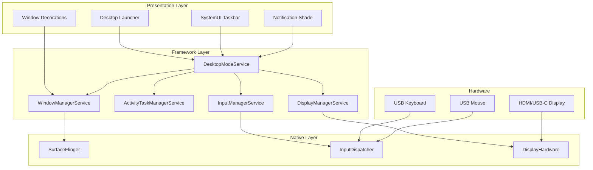

### 2.2 Component Responsibilities

| Component | Responsibility | Location |
|-----------|----------------|----------|
| **DesktopModeService** | Central coordinator; manages desktop state, display detection, taskbar lifecycle | `frameworks/base/services/core/java/com/android/server/desktop/` |
| **Desktop Launcher** | Home screen app; runs on external display ID only | `packages/apps/DesktopLauncher/` |
| **SystemUI Taskbar** | Bottom bar with Start button, running apps, system tray | `packages/SystemUI/` (plugin/extension) |
| **WindowManagerService** | Window positioning, sizing, Z-ordering, freeform stack management | `frameworks/base/services/core/java/com/android/server/wm/` |
| **ActivityTaskManagerService** | Activity launching, task management, display assignment | `frameworks/base/services/core/java/com/android/server/activitytask/` |
| **DisplayManagerService** | Display detection, configuration, hotplug handling | `frameworks/base/services/core/java/com/android/server/display/` |
| **InputManagerService** | Input device detection, pointer events, hover handling | `frameworks/base/services/core/java/com/android/server/input/` |

### 2.3 Dependency Graph

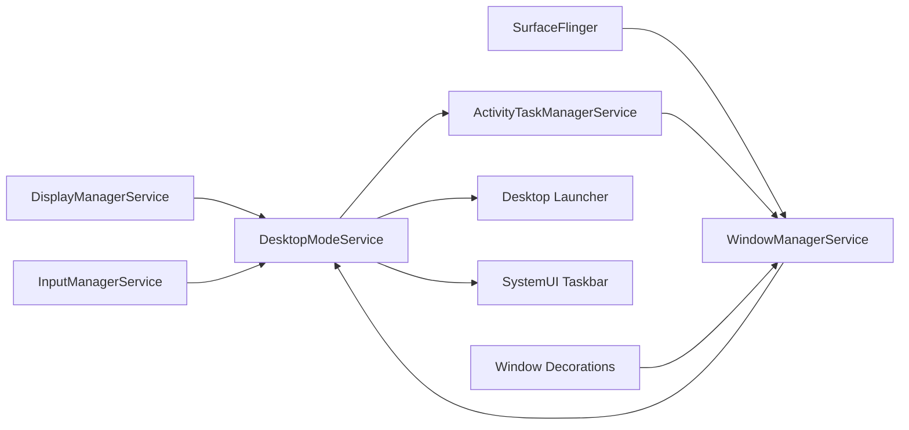

---

## 3. Data Flow Architecture

### 3.1 Display Connection Flow

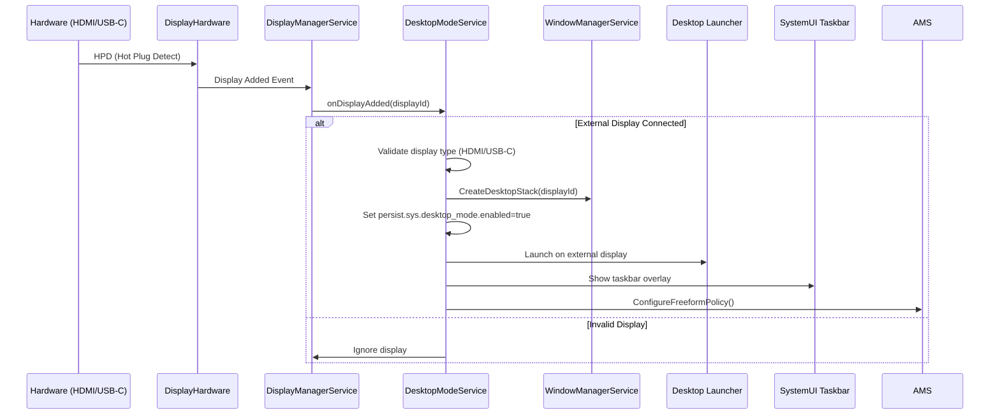

### 3.2 Window Management Data Flow

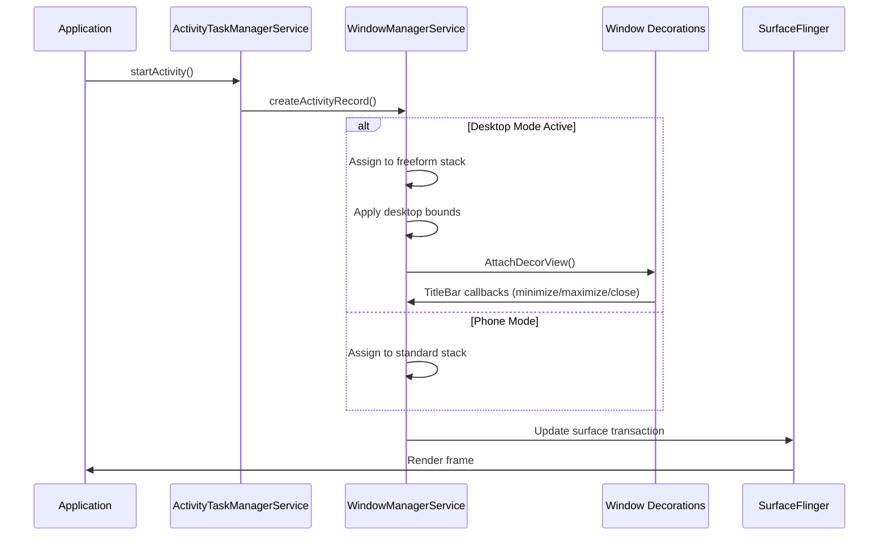

### 3.3 Input Event Pipeline

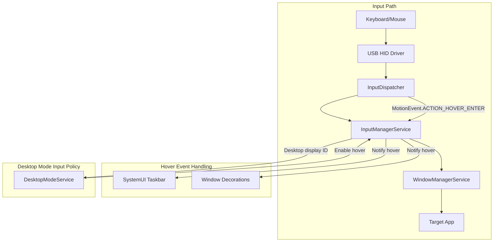

### 3.4 Key Data Structures

#### DesktopModeState

```kotlin
data class DesktopModeState(
    val enabled: Boolean,
    val displayId: Int,
    val displayType: Int,           // from Display.TYPE_*
    val windowingMode: Int,          // WINDOWING_MODE_FREEFORM
    val taskbarVisible: Boolean,
    val activeTasks: List<TaskId>,
    val systemProperties: DesktopSystemProperties
)

data class DesktopSystemProperties(
    val persistDesktopEnabled: Boolean,
    val desktopDpi: Int,
    val desktopDensity: Int,
    val desktopWidth: Int,
    val desktopHeight: Int
)
```

#### WindowInfo

```kotlin
data class WindowInfo(
    val token: IBinder,
    val activityRecord: ActivityRecord,
    val bounds: Rect,
    val windowingMode: Int,
    val visibility: Int,
    val decorations: WindowDecorations?,
    val canMinimize: Boolean,
    val canMaximize: Boolean,
    val canClose: Boolean
)
```

---

## 4. API Interfaces Between Layers

### 4.1 DesktopModeService Public API

```kotlin
interface IDesktopModeService {
    // State queries
    fun isDesktopModeEnabled(): Boolean
    fun getDesktopDisplayId(): Int
    fun getDesktopState(): DesktopModeState
    
    // Window management
    fun setWindowingMode(taskId: Int, windowingMode: Int): Boolean
    fun minimizeWindow(taskId: Int): Boolean
    fun maximizeWindow(taskId: Int): Boolean
    fun closeWindow(taskId: Int): Boolean
    fun resizeWindow(taskId: Int, bounds: Rect): Boolean
    
    // Display control
    fun enableDesktopMode(): void
    fun disableDesktopMode(): void
    
    // Taskbar control
    fun setTaskbarVisibility(visible: Boolean): void
    fun getRunningDesktopTasks(): List<WindowInfo>
    
    // Listeners
    fun addDesktopModeListener(listener: IDesktopModeListener): void
    fun removeDesktopModeListener(listener: IDesktopModeListener): void
}

interface IDesktopModeListener {
    fun onDesktopModeEnabled(displayId: Int)
    fun onDesktopModeDisabled()
    fun onWindowAdded(windowInfo: WindowInfo)
    fun onWindowRemoved(taskId: Int)
    fun onWindowFocusChanged(taskId: Int, hasFocus: Boolean)
    fun onDisplayHotplug(displayId: Int, connected: Boolean)
}
```

### 4.2 Internal Framework APIs

#### IActivityTaskManager Extension

```java
interface IActivityTaskManager {
    // Existing AOSP methods...
    
    // Desktop mode extensions
    int getDesktopDisplayId();
    void setForceDesktopMode(boolean enabled);
    List<TaskInfo> getDesktopTasks();
    boolean setTaskWindowingMode(int taskId, int windowingMode);
}
```

#### IWindowManager Extension

```java
interface IWindowManager {
    // Existing AOSP methods...
    
    // Desktop mode extensions
    void createDesktopDisplayStack(int displayId);
    void removeDesktopDisplayStack(int displayId);
    void attachWindowDecorations(IBinder token, WindowDecorationsInfo info);
    void setWindowBounds(IBinder token, Rect bounds);
    WindowLayoutInfo getWindowLayoutInfo(IBinder token);
}
```

### 4.3 Binder IPC Boundaries

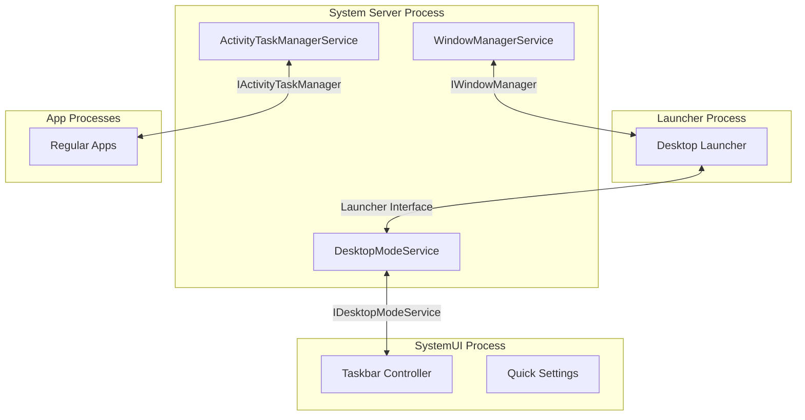

### 4.4 System Properties

| Property | Type | Default | Description |
|----------|------|---------|-------------|
| `persist.sys.desktop_mode.enabled` | bool | false | Global desktop mode enable flag |
| `persist.sys.desktop_mode.display` | int | -1 | Active desktop display ID |
| `persist.sys.desktop_mode.dpi` | int | 240 | Desktop display DPI |
| `persist.sys.desktop_mode.density` | int | 160 | Desktop display density |
| `debug.sys.desktop_mode.verbose` | bool | false | Enable verbose logging |
| `ro.sys.desktop_mode.supported` | bool | false | Device supports desktop mode |

---

## 5. State Management Approach

### 5.1 State Machine

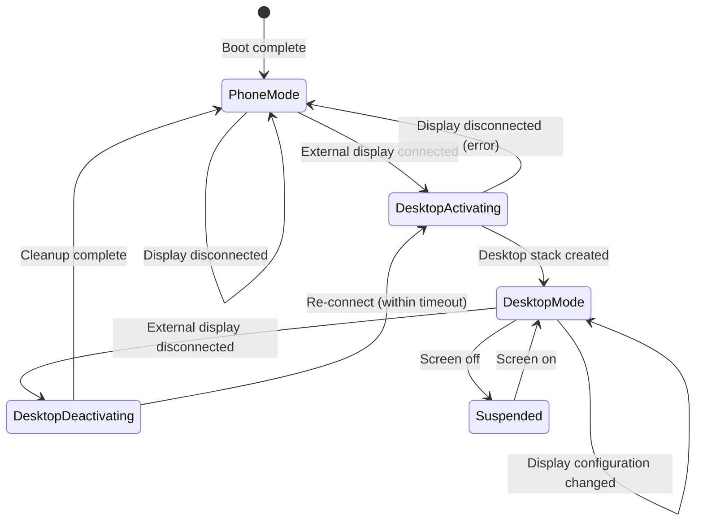

### 5.2 State Persistence

```kotlin
// Persistent state (survives process death)
class DesktopModePersistence {
    // Written to persistent storage (SharedPreferences / NVS)
    var lastEnabledDisplayId: Int = -1
    var windowPositions: Map<Int, Rect> = emptyMap()  // taskId -> bounds
    var favoriteApps: List<String> = emptyList()
    var taskbarPosition: Int = BOTTOM  // BOTTOM, LEFT, RIGHT
    var desktopWallpaper: String? = null
}

// Runtime state (in-memory only)
class DesktopModeRuntime {
    var currentState: DesktopModeState = DISABLED
    var activeDisplayId: Int = -1
    var desktopStackId: Int = -1
    var runningTasks: List<TaskInfo> = emptyList()
    var focusedTaskId: Int = -1
    var taskbarController: TaskbarController? = null
}
```

### 5.3 State Transitions

| Transition | Trigger | Actions |
|------------|---------|---------|
| PhoneMode → DesktopActivating | `DisplayManagerService.onDisplayAdded` with external type | Validate display, create desktop stack, start launcher |
| DesktopActivating → DesktopMode | All components initialized | Show taskbar, enable input handlers, broadcast state |
| DesktopMode → DesktopDeactivating | `DisplayManagerService.onDisplayRemoved` | Hide taskbar, pause non-visible apps, persist state |
| DesktopDeactivating → PhoneMode | Cleanup complete | Destroy desktop stack, release resources |
| DesktopMode → Suspended | `PowerManagerService` screen off | Dim displays, pause animations |
| Suspended → DesktopMode | Screen on | Restore brightness, resume animations |

### 5.4 Observer Pattern Implementation

```kotlin
// DesktopModeStateNotifier handles all state subscriptions
class DesktopModeStateNotifier {
    private val listeners = CopyOnWriteArrayList<IDesktopModeListener>()
    private val state = AtomicReference(DesktopModeState.DISABLED)
    
    fun notifyStateChanged(newState: DesktopModeState) {
        state.set(newState)
        listeners.forEach { listener ->
            try {
                listener.onDesktopStateChanged(newState)
            } catch (e: RemoteException) {
                // Handle remote death
            }
        }
    }
    
    fun registerListener(listener: IDesktopModeListener) {
        listeners.add(listener)
    }
    
    fun unregisterListener(listener: IDesktopModeListener) {
        listeners.remove(listener)
    }
}
```

---

## 6. Display Detection and Mode Switching

### 6.1 Display Detection Logic

```mermaid
flowchart TD
    A[Display Hotplug Event] --> B{Is External Display?}
    
    B -->|Yes| C{Valid Resolution?}
    B -->|No| D[Ignore - Phone Display]
    
    C -->|Yes| E{Has Input Devices?}
    C -->|No| D
    
    E -->|Yes| F[Enable Desktop Mode]
    E -->|No| G[Enable Desktop Mode (Limited)]
    
    F --> H[Launch Desktop Launcher]
    G --> H
    
    F --> I[Enable Full Features]
    G --> J[Disable Mouse/Keyboard Features]
    
    H --> K[Show Taskbar]
    I --> L[Ready for User Input]
    J --> L
```

### 6.2 Display Detection Algorithm

```kotlin
class DesktopDisplayDetector(
    private val displayManager: DisplayManager,
    private val inputManager: InputManager
) {
    companion object {
        private val EXTERNAL_DISPLAY_TYPES = setOf(
            Display.TYPE_HDMI,
            Display.TYPE_WIRED,
            Display.TYPE_OVERLAY,
            Display.TYPE_VIRTUAL  // For testing
        )
        
        private val MIN_DESKTOP_WIDTH = 1024
        private val MIN_DESKTOP_HEIGHT = 768
    }
    
    fun detectDesktopDisplay(): Display? {
        val displays = displayManager.displays
        
        return displays.firstOrNull { display ->
            isExternalDisplay(display) && 
            meetsMinimumRequirements(display)
        }
    }
    
    private fun isExternalDisplay(display: Display): Boolean {
        return display.type in EXTERNAL_DISPLAY_TYPES &&
               display.flags and Display.FLAG_NEVER_BLANK != 0
    }
    
    private fun meetsMinimumRequirements(display: Display): Boolean {
        val metrics = DisplayMetrics()
        display.getRealMetrics(metrics)
        return metrics.widthPixels >= MIN_DESKTOP_WIDTH &&
               metrics.heightPixels >= MIN_DESKTOP_HEIGHT
    }
    
    fun hasInputDevices(): Boolean {
        val devices = inputManager.inputDeviceIds
        val inputDevices = devices.map { inputManager.getInputDevice(it) }
        
        val hasKeyboard = inputDevices.any { 
            it.supportsSource(InputDevice.SOURCE_KEYBOARD) 
        }
        val hasMouse = inputDevices.any { 
            it.supportsSource(InputDevice.SOURCE_MOUSE) ||
            it.supportsSource(InputDevice.SOURCE_TOUCHPAD)
        }
        
        return hasKeyboard || hasMouse
    }
}
```

### 6.3 Mode Switching Sequence

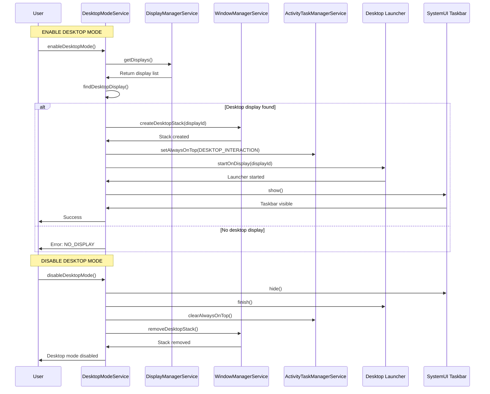

### 6.4 Display Configuration

```kotlin
data class DesktopDisplayConfig(
    val displayId: Int,
    val width: Int,
    val height: Int,
    val densityDpi: Int,
    val refreshRate: Float = 60f,
    val orientation: Int = Configuration.ORIENTATION_LANDSCAPE,
    val flags: Int = 0
) {
    companion object {
        fun createDefault(width: Int, height: Int): DesktopDisplayConfig {
            // Calculate density based on screen diagonal
            // Default to 1920x1080 scaled to ~240dpi for readable UI
            return DesktopDisplayConfig(
                displayId = Display.DEFAULT_DISPLAY,  // Will be reassigned
                width = width,
                height = height,
                densityDpi = calculateOptimalDpi(width, height),
                refreshRate = 60f,
                orientation = Configuration.ORIENTATION_LANDSCAPE,
                flags = Display.FLAG_NEVER_BLANK or 
                        Display.FLAG_SECURE or
                        Display.FLAG_SUPPORTS_PROTECTED_LAYERS
            )
        }
        
        private fun calculateOptimalDpi(width: Int, height: Int): Int {
            // For typical 1080p displays, use 160dpi base
            // Scale proportionally for other resolutions
            val baseResolution = 1920 * 1080
            val currentResolution = width * height
            val scale = Math.sqrt(currentResolution.toDouble() / baseResolution)
            return (160 * scale).toInt().coerceIn(120, 480)
        }
    }
}
```

---

## 7. Window Management Implementation

### 7.1 Window Stack Architecture

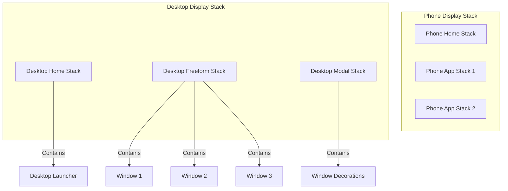

### 7.2 Freeform Window Implementation

```kotlin
class FreeformWindowManager(
    private val windowManagerService: WindowManagerService,
    private val activityTaskManager: ActivityTaskManagerService
) {
    companion object {
        const val WINDOWING_MODE_FREEFORM = 5
        const val DEFAULT_WINDOW_WIDTH = 800
        const val DEFAULT_WINDOW_HEIGHT = 600
        const val MIN_WINDOW_WIDTH = 320
        const val MIN_WINDOW_HEIGHT = 240
    }
    
    fun createFreeformWindow(activityRecord: ActivityRecord): WindowState {
        val displayContent = windowManagerService.getDisplayContent(
            activityRecord.getDisplayId()
        )
        
        // Calculate default position (centered)
        val bounds = calculateDefaultBounds(displayContent)
        
        // Configure activity options for freeform
        val options = ActivityOptions.makeBasic()
        options.setLaunchWindowingMode(WINDOWING_MODE_FREEFORM)
        options.setLaunchBounds(bounds)
        
        // Apply to activity record
        activityRecord.setWindowingMode(WINDOWING_MODE_FREEFORM)
        activityRecord.setBounds(bounds)
        
        return windowManagerService.addWindow(activityRecord)
    }
    
    private fun calculateDefaultBounds(displayContent: DisplayContent): Rect {
        val displayBounds = displayContent.bounds
        val width = DEFAULT_WINDOW_WIDTH
        val height = DEFAULT_WINDOW_HEIGHT
        
        // Center on display
        val left = (displayBounds.width() - width) / 2
        val top = (displayBounds.height() - height) / 2
        
        return Rect(left, top, left + width, top + height)
    }
    
    fun resizeWindow(window: WindowState, newBounds: Rect): Boolean {
        val validatedBounds = validateBounds(newBounds)
        
        if (!validatedBounds.isValid) {
            return false
        }
        
        window.setBounds(validatedBounds)
        windowManagerService.relayoutWindow(window)
        
        return true
    }
    
    private fun validateBounds(requested: Rect): Rect {
        return Rect(
            requested.left,
            requested.top,
            requested.left.coerceAtLeast(MIN_WINDOW_WIDTH),
            requested.top.coerceAtLeast(MIN_WINDOW_HEIGHT)
        )
    }
}
```

### 7.3 Window Decoration System

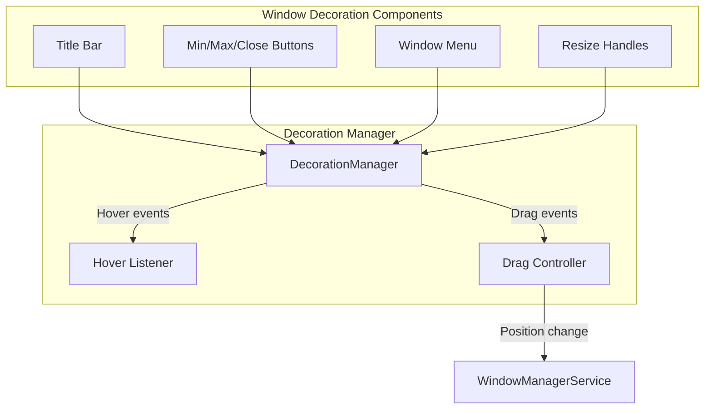

### 7.4 Window Decoration API

```kotlin
interface WindowDecorationController {
    fun attachDecorations(windowToken: IBinder): WindowDecorations
    fun updateDecorations(windowToken: IBinder, info: WindowDecorationInfo)
    fun removeDecorations(windowToken: IBinder)
    fun onMinimizeClick(windowToken: IBinder)
    fun onMaximizeClick(windowToken: IBinder)
    fun onCloseClick(windowToken: IBinder)
    fun onDragStart(windowToken: IBinder, initialPosition: Point)
    fun onDragMove(windowToken: IBinder, delta: Point)
    fun onDragEnd(windowToken: IBinder)
}

data class WindowDecorationInfo(
    val title: String,
    val icon: Icon?,
    val appName: String,
    val backgroundColor: Int = Color.TRANSPARENT,
    val textColor: Int = Color.WHITE,
    val showMinimize: Boolean = true,
    val showMaximize: Boolean = true,
    val showClose: Boolean = true,
    val canResize: Boolean = true
)
```

### 7.5 Taskbar Implementation

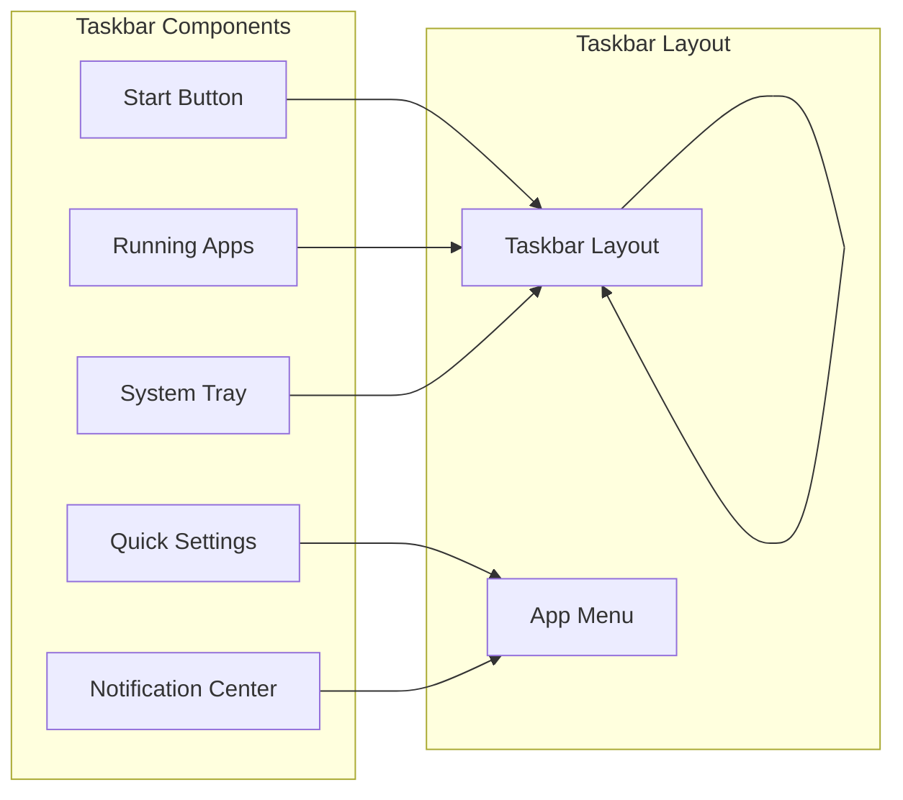

### 7.6 Taskbar Data Model

```kotlin
data class TaskbarItem(
    val taskId: Int,
    val packageName: String,
    val appName: String,
    val icon: Bitmap?,
    val thumbnail: Bitmap?,  // Recent thumbnail
    val isActive: Boolean,
    val hasFocus: Boolean,
    val label: String
)

class TaskbarState {
    val items: List<TaskbarItem> = emptyList()
    val startMenuVisible: Boolean = false
    val systemTrayExpanded: Boolean = false
    val notificationCount: Int = 0
    val clock: String = ""
    val batteryLevel: Int = 0
    val volumeLevel: Int = 0
}
```

---

## 8. Build Configuration

### 8.1 Android.bp Structure

```python
// ============================================================
// Desktop Mode Framework Library
// ============================================================

java_library {
    name: "desktop-mode-framework",
    srcs: [
        "src/**/*.java",
        "src/**/*.kt",
    ],
    static_libs: [
        "androidx.core_core",
        "androidx.lifecycle_lifecycle-runtime",
        "framework",
    ],
    sdk_version: "core_platform",
    installable: false,
    permitted_packages: [
        "com.android.server.desktop",
    ],
}

// ============================================================
// Desktop Mode Service
// ============================================================

java_library {
    name: "desktop-mode-service",
    srcs: ["src/service/**/*.java"],
    static_libs: [
        "desktop-mode-framework",
        "services.core",
    ],
    libs: [
        "framework",
        "framework-annotations-lib",
    ],
}

// ============================================================
// Desktop Launcher App
// ============================================================

android_app {
    name: "DesktopLauncher",
    srcs: ["src/**/*.java", "src/**/*.kt"],
    resource_dirs: ["res"],
    static_libs: [
        "androidx.core_core",
        "androidx.recyclerview_recyclerview",
        "androidx.leanback_leanback",
    ],
    sdk_version: "system_current",
    product_specific: true,
    privileged: true,
    required: [
        "default_permissions",
        "desktop-mode-service",
    ],
}

// ============================================================
// Desktop Mode SystemUI Plugin
// ============================================================

android_library {
    name: "desktop-mode-systemui",
    srcs: ["src/**/*.{java,kt}"],
    resource_dirs: ["res"],
    static_libs: [
        "SystemUI-core",
        "desktop-mode-framework",
    ],
    sdk_version: "system_current",
}
```

### 8.2 System Properties Configuration

```python
// In device.mk or system properties file
PRODUCT_PROPERTY_OVERRIDES += \
    persist.sys.desktop_mode.enabled=false \
    persist.sys.desktop_mode.display=-1 \
    persist.sys.desktop_mode.dpi=240 \
    ro.sys.desktop_mode.supported=true
```

### 8.3 SELinux Policy

```text
// desktop_mode.te
type desktop_mode_service, service_manager_type;
type desktop_mode_exec, exec_type, file_type;

allow desktop_mode_service activity_task_service:service_manager find;
allow desktop_mode_service window_service:service_manager find;
allow desktop_mode_service display_service:service_manager find;

# Allow desktop mode to create a domain
neverallow { domain -desktop_mode_service } desktop_mode_service:*

// desktop_mode.te (property)
set_prop(desktop_mode_service, persist_sys_desktop_mode_prop)
get_prop(desktop_mode_service, persist_sys_desktop_mode_prop)
```

---

## 9. CI/CD Pipeline

### 9.1 GitHub Actions Workflow

```yaml
name: Desktop Mode Build and Test

on:
  push:
    branches: [main, android-14, android-15, android-16]
  pull_request:
    branches: [main]

env:
  JAVA_VERSION: '17'
  ANDROID_SDK_ROOT: '/opt/android-sdk'

jobs:
  lint:
    name: Code Lint
    runs-on: ubuntu-latest
    steps:
      - name: Checkout code
        uses: actions/checkout@v4

      - name: Set up JDK
        uses: actions/setup-java@v4
        with:
          java-version: ${{ env.JAVA_VERSION }}
          distribution: 'temurin'

      - name: Run Kotlin Lint
        run: |
          ./gradlew ktlintCheck

      - name: Run Java Lint
        run: |
          ./gradlew checkstyleMain

  build-framework:
    name: Build Framework Module
    runs-on: ubuntu-latest
    container: androidbuild/android-14:latest
    steps:
      - name: Checkout code
        uses: actions/checkout@v4

      - name: Build Framework
        run: |
          source build/envsetup.sh
          lunch aosp_arm64-userdebug
          m desktop-mode-framework

      - name: Upload Artifacts
        uses: actions/upload-artifact@v4
        with:
          name: framework-build
          path: out/target/product/generic/obj/JAVA_LIBRARIES/desktop-mode-framework*

  build-launcher:
    name: Build Desktop Launcher
    runs-on: ubuntu-latest
    steps:
      - name: Checkout code
        uses: actions/checkout@v4

      - name: Set up JDK
        uses: actions/setup-java@v4
        with:
          java-version: ${{ env.JAVA_VERSION }}
          distribution: 'temurin'

      - name: Build Launcher
        run: |
          ./gradlew :DesktopLauncher:assembleDebug

      - name: Upload APK
        uses: actions/upload-artifact@v4
        with:
          name: desktop-launcher-apk
          path: DesktopLauncher/build/outputs/apk/debug/DesktopLauncher.apk

  test-unit:
    name: Unit Tests
    runs-on: ubuntu-latest
    steps:
      - name: Checkout code
        uses: actions/checkout@v4

      - name: Set up JDK
        uses: actions/setup-java@v4
        with:
          java-version: ${{ env.JAVA_VERSION }}
          distribution: 'temurin'

      - name: Run Tests
        run: |
          ./gradlew test

      - name: Upload Test Results
        uses: actions/upload-artifact@v4
        if: always()
        with:
          name: test-results
          path: '**/build/test-results/**/*.xml'
```

### 9.2 Build Artifacts

| Artifact | Location | Description |
|----------|----------|-------------|
| `DesktopLauncher.apk` | `out/target/product/*/system_ext/priv-app/` | Privileged launcher app |
| `desktop-mode-framework.jar` | `out/target/product/*/obj/JAVA_LIBRARIES/` | Framework library |
| `desktop-mode-service.jar` | `out/target/product/*/framework/` | System service |

---

## 10. Summary

### 10.1 Architecture Highlights

| Aspect | Implementation |
|--------|----------------|
| **Display Detection** | `DisplayManagerService` hotplug events + validation |
| **Mode Switching** | State machine with Phone/Desktop/Suspended states |
| **Window Management** | Freeform stack in `WindowManagerService` |
| **Input Handling** | Extended `InputManagerService` for hover events |
| **Taskbar** | SystemUI plugin with custom controller |
| **Build** | Standard AOSP `Android.bp` configuration |

### 10.2 Extension Points

The architecture supports future extensions:
- **Multiple Desktop Modes**: Easy to add "Tabletop Mode" or "Folded Mode"
- **Window Snap**: Can add window snapping via `WindowDecorationController`
- **Multi-Window Groups**: Extend `ActivityTaskManagerService` for group management

### 10.3 Compatibility Matrix

| Android Version | Framework Changes | Launcher | Taskbar |
|-----------------|-------------------|----------|---------|
| Android 13 | Core modifications | API 33 | SystemUI plugin |
| Android 14 | Same as 13 + improvements | API 34 | SystemUI plugin |
| Android 15 | Enhanced multi-display | API 35 | SystemUI plugin |
| Android 16 | Future compatibility | API 36 | SystemUI plugin |

---

*Document maintained by: AOSP Desktop Mode Team*  
*License: Apache 2.0*
